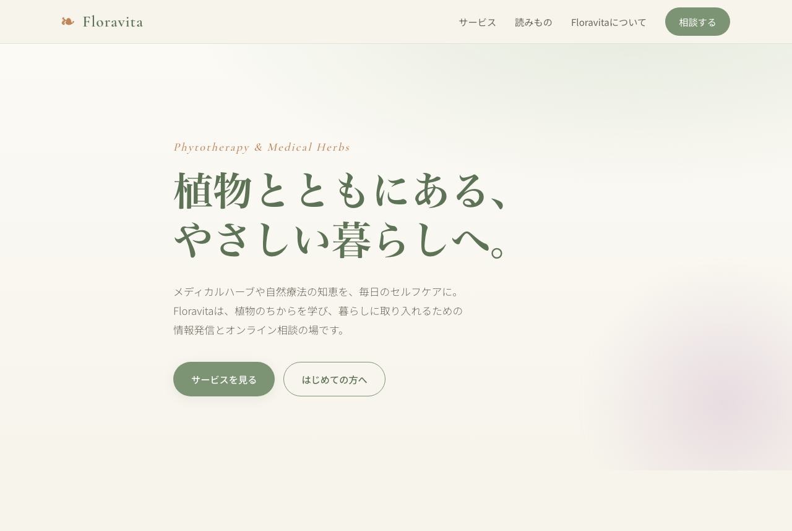

# Floravita（フロラヴィータ）— 練習用プロジェクト

植物療法・メディカルハーブ・自然療法に関する **情報発信＆オンライン相談** をテーマにした、ウェルネスブランドの情報発信サイト（練習用デモ）です。

> ⚠️ 本プロジェクトは学習・練習を目的としたデモです。掲載しているテキストは一般的な知識の紹介であり、医療行為・診断・治療を目的とするものではありません。

---

## 🌿 コンセプト

- **ブランド名の由来**: `Flora`（花・植物）＋ `Vita`（いのち・暮らし）
- **デザイン方針**: 洗練されたナチュラル × 知的 × 信頼感
- **カラー**: セージグリーンを基調に、クリーム・テラコッタ・花色のアクセントを添えた、やさしく落ち着いたトーン

---

## 📸 完成イメージ



---

## 📁 ファイル構成

| ファイル | 役割 |
|---------|------|
| `index.html` | メインページ。ヒーロー / サービス / 読みもの（ブログ枠）/ About / お問い合わせ / フッターで構成 |
| `style.css` | デザイン全体。CSS変数でカラートークンを定義し、レスポンシブ対応（冒頭に番号付き目次あり） |
| `script.js` | トップページ専用：ポップアップ（モーダル）、カード動的生成、カテゴリ絞り込み、フォーム送信デモ |
| `ui.js` | 全ページ共通：モバイルナビ開閉、ダークモード切替、スクロール出現アニメーション |
| `herbs.html` | ハーブ図鑑ページ（名前検索＋カテゴリ絞り込み） |
| `herbs.js` | ハーブ図鑑の描画・検索・絞り込みロジック |
| `data/articles.js` | 読みもの記事のデータ（単一の情報源。ここを編集すると一覧・個別ページに反映） |
| `data/herbs.js` | ハーブ図鑑のデータ |
| `articles/article.html` | 記事の個別ページ（テンプレート。`?id=▲▲` で記事を切り替え） |
| `articles/article.js` | 個別ページの描画ロジック（URLの id から記事を表示） |
| `favicon.svg` | ブラウザタブ用アイコン（葉モチーフのSVG） |
| `images/screenshot.png` | トップページの完成イメージ（README掲載用） |
| `.gitignore` | Git管理時の除外設定（.DS_Store 等） |
| `README.md` | このファイル。プロジェクト概要と今後のメモ |

外部ライブラリ・ビルドツールは不使用。`index.html` をブラウザで開くだけで動作します（記事データは `<script>` で読み込むため、`file://` で直接開いても動きます）。

### フォルダ構成と今後の配置方針

| フォルダ | 用途 |
|---------|------|
| `data/` | 記事データなど（`articles.js`）。記事の追加・編集はここだけでOK |
| `articles/` | 記事の個別ページ（テンプレート＋描画スクリプト） |
| `images/` | スクリーンショット・写真・ハーブ画像などの画像素材 |

---

## ✨ 実装済みの機能

- レスポンシブ対応（PC / タブレット / スマホ、ハンバーガーメニュー）
- 「はじめての方へ」ポップアップ（モーダル／オーバーレイ・Escキー・外側クリックで閉じる、フォーカス管理＋トラップ付き）
- 読みものカードの **データ駆動の動的生成**（`data/articles.js` から JS で描画）
- 読みものの **カテゴリ別絞り込み**（すべて / ハーブ / 暮らし / 季節、`aria-pressed` 対応）
- **記事の個別ページ**（`articles/article.html?id=▲▲`。一覧カードからリンク）
- **ハーブ図鑑ページ**（`herbs.html`。キーワード検索＋カテゴリ絞り込み）
- **ダークモード切り替え**（トグルボタン。`localStorage` に保存、OSの設定も初期値に反映）
- **スクロール連動の出現アニメーション**（`IntersectionObserver`。`prefers-reduced-motion` 尊重）
- お問い合わせフォームの **送信デモ**（実送信なし）
- OGP / Twitter Card メタタグ、favicon
- Google Fonts（Cormorant Garamond × Noto Sans JP）による英日混在対応のタイポグラフィ

---

## 🚀 ローカルでの確認方法

```bash
# このフォルダを開いて index.html をブラウザにドラッグ＆ドロップ、
# または簡易サーバーを立てて確認
python3 -m http.server 8000
# → http://localhost:8000 にアクセス
```

---

## 📝 今後実装したい機能（メモ）

- [x] ブログ記事の個別ページ（詳細ページ）とリンク
- [x] 記事データを分離（`data/articles.js`）し、JS で動的にカード生成 ※サーバー運用に切り替える場合は `articles.json` + `fetch()` へ移行可
- [ ] お問い合わせフォームの実送信（フォームサービス連携 or バックエンド）
- [ ] オンライン相談の予約カレンダー
- [x] ハーブ図鑑ページ（検索・絞り込み）
- [ ] ニュースレター登録フォーム
- [x] ダークモード切り替え
- [x] スクロール連動アニメーション（Intersection Observer）
- [ ] 多言語対応（日本語 / 英語）
- [ ] 薬機法に配慮した表現ガイドラインの整備とレビュー体制

---

## 🪴 コピー作成上の注意（薬機法配慮）

植物療法・ハーブを扱うため、以下の表現は避ける方針です。

- 「治る」「効く」「○○が治療できる」などの **断定的な効能・効果の標榜**
- 医薬品的な印象を与える表現

代わりに「暮らしに取り入れる」「セルフケアをサポートする」「寄り添う」など、
やさしくニュートラルな表現を使用しています。
